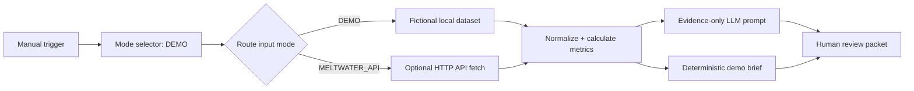

# Meltwater Media Intelligence → Executive Communications Brief

An open-source n8n workflow that turns Meltwater-style media and social monitoring data into a concise, evidence-grounded briefing packet for senior marketing and communications teams.

This is an independent open-source project. It is not sponsored, endorsed, or maintained by Meltwater.

## The business problem

A media-monitoring export can show volume and sentiment, but executives need decisions: what happened, what changed, why it matters, which narratives are emerging, what could damage reputation, and what communications action is sensible next. This workflow keeps the quantitative layer deterministic and uses an optional LLM handoff only after those calculations.

## Architecture



## What is calculated

The Code node calculates only fields present in the input: mention count, previous-period comparison, sentiment distribution, leading sources, themes and emerging themes, reach, high-impact mentions, competitor/share-of-voice data, authors, geographies, and an unusual-spike signal. Missing fields are returned as `unavailable` rather than inferred.

The LLM prompt requires evidence IDs for every assertion and explicitly forbids invented coverage, statistics, or causality. Demo Mode does not call an LLM: it produces a deterministic fallback brief and exposes the prompt for an optional model connection after review.

## Demo Mode (default)

1. Import [`workflow/meltwater-media-intelligence-executive-brief.json`](workflow/meltwater-media-intelligence-executive-brief.json) into n8n.
2. Run **Meltwater Media Intelligence → Executive Communications Brief**.
3. Inspect **Human Review Packet**. The dataset is fictional and represents a hypothetical cybersecurity company, AegisLayer; it does not describe a real brand.

The Code node is self-contained so the imported workflow works on n8n Cloud without assuming access to a local filesystem. [`demo-data/meltwater-style-demo.json`](demo-data/meltwater-style-demo.json) is the fuller reference fixture.

## Optional Meltwater API Mode

API Mode is intentionally opt-in. Provide the full endpoint specified by the legitimate Meltwater contract/current documentation and configure these values as n8n environment variables or an approved credential mechanism:

```text
MELTWATER_API_BASE_URL=<contract-specific endpoint>
MELTWATER_API_TOKEN=<secret; never commit>
MELTWATER_SAVED_SEARCH_ID=<saved-search identifier>
```

Change `input_mode` in **Mode Selector** to `MELTWATER_API`, validate the returned response shape, and keep the workflow inactive until tested. Endpoint names and response schemas can vary by product and access tier; this repository does not guess them. See [`docs/meltwater-api.md`](docs/meltwater-api.md).

An official remote Meltwater MCP connection is not implemented in this MVP. If adding one later, follow the current official Meltwater and n8n documentation and preserve the same deterministic-first and review-only boundaries.

## Human review and safety

The final node creates a structured review packet and sets `human_review_required: true`. It does not send email, publish, post, or contact journalists. Remove or redact confidential, personal, client, employer, credential, and proprietary information before using real data. Do not commit tokens or raw sensitive exports.

## Repository structure

```text
workflow/   importable n8n workflow JSON
demo-data/  fictional Meltwater-style JSON fixture
docs/       setup, analysis logic, and API configuration notes
```

## Sources and further reading

- [n8n Code node cookbook](https://docs.n8n.io/code/cookbook/code-node/)
- [n8n data mapping](https://docs.n8n.io/data/data-mapping/data-mapping-ui/)
- [n8n workflow sharing and credentials](https://docs.n8n.io/workflows/sharing/)
- [n8n source control environments](https://docs.n8n.io/source-control-environments/create-environments/)

## License

MIT. See [`LICENSE`](LICENSE).
